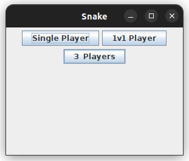
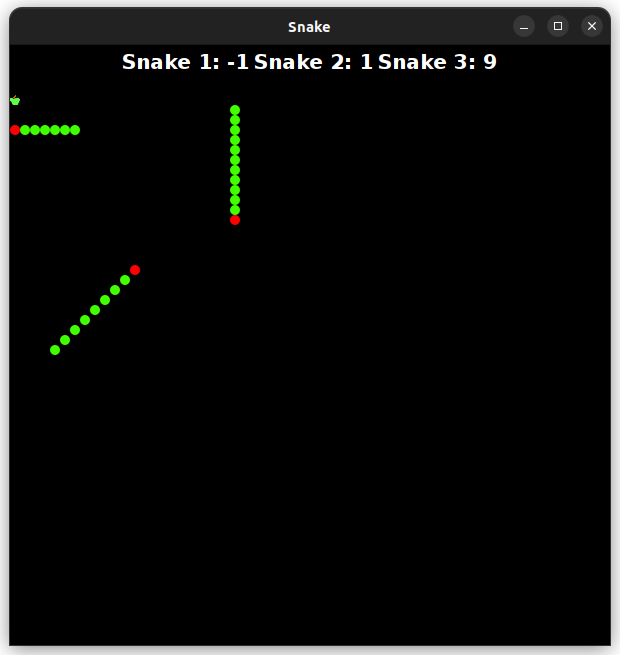

# Snake Game

This Snake Game offers three exciting modes:

- **Single Player:** Play as the snake, maneuvering through the challenges solo.
- **1v1 Player:** Engage in a head-to-head battle with another player on the same keyboard.
- **Three Player:** Join forces or compete against two other players on the same screen.

## Key Mapping

### Single Player Mode
- **Arrow keys (UP, DOWN, LEFT, RIGHT):** Move in cardinal directions.
- **Q, E, A, D:**                          Diagonal movement options. (NW, NE, SW, SE).

### 1v1 Player
**Player 1**
- **Numpad Keys (8, 5, 4, 6):** Basic movement controls .
- **7, 9, 1, 3:**       Diagonal movement options.  (UP_LEFT, UP_RIGHT, DOWN_LEFT, DOWN_LEFT).

**Player 2**
- **W, A, S, D:**          Basic movement controls
- **E, Q, F, Left_Shift:** Diagonal movement options. 

### Three Player
**Player 1**
- **Numpad Keys (8, 5, 4, 6):** Basic movement controls .
- **7, 9, 1, 3:**         Diagonal movement options.(UP_LEFT, UP_RIGHT, DOWN_LEFT, DOWN_LEFT).

**Player 2**
- **W, A, S, D:**          Basic movement controls
- **Q, E, F, Left_Shift:** Diagonal movement options.(UP_LEFT, UP_RIGHT, DOWN_LEFT, DOWN_LEFT). 

**Player 3**
- **I, J, K, L:**          Basic movement controls
- **U, O, H, SEMI_COLON:** Diagonal movement options.(UP_LEFT, UP_RIGHT, DOWN_LEFT, DOWN_LEFT). 

## Folder Structure

Within the workspace, you'll find two default folders:

- `src`: Contains the source code for the game.
- `lib`: Houses dependencies required for the game.

Feel free to explore the folders and their contents to understand and modify the game as needed!

## ScreenShots

